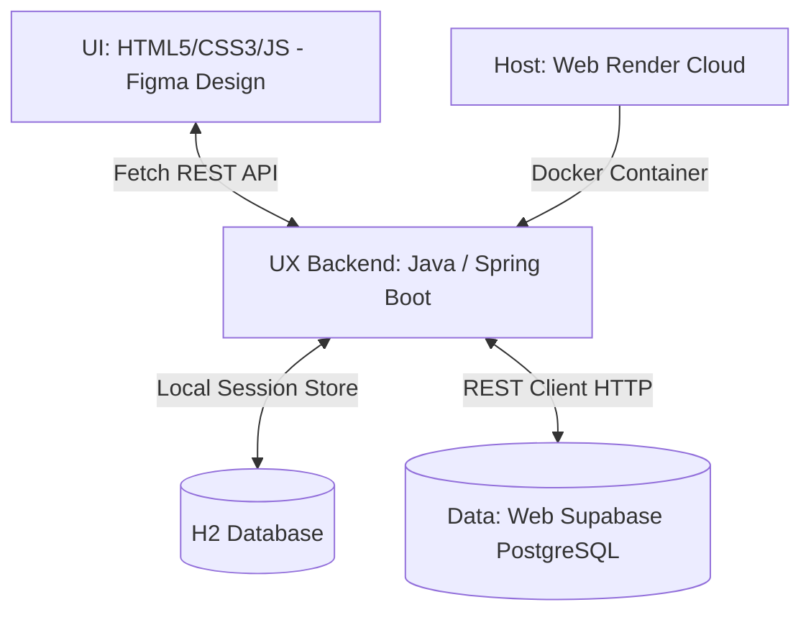

# Hệ thống Quản lý RFID & Mô phỏng Cửa hàng (RFID Management & Store Simulation System)

Tài liệu này trình bày chi tiết về kiến trúc công nghệ và mô hình triển khai của đồ án **Quản lý RFID & Mô phỏng Cửa hàng**, được hoàn thiện dựa trên sơ đồ công nghệ thực tế của dự án.

---

## 🗺️ Tổng quan Kiến trúc Công nghệ (Tech Stack)

Dưới đây là chi tiết 5 thành phần cốt lõi của hệ thống tương ứng với mô tả thiết kế:

---

### 1. 🗄️ Data - Web Supabase (Cơ sở dữ liệu đám mây)
Hệ thống sử dụng **Supabase Cloud** làm nền tảng lưu trữ dữ liệu sản phẩm trung tâm (PostgreSQL).
*   **Bảng dữ liệu:**
    *   `products`: Lưu trữ thông tin danh mục sản phẩm, mã vạch (SKU), giá, thông tin hình ảnh và tổng số lượng tồn kho.
    *   `product_sizes`: Lưu trữ thông tin chi tiết về kích cỡ (Size) và số lượng tồn kho của từng size tương ứng với mỗi sản phẩm (quan hệ 1-nhiều với bảng `products`).
*   **Cơ chế kết nối:**
    *   Backend Spring Boot sử dụng `java.net.http.HttpClient` để gọi trực tiếp các REST API bảo mật của Supabase thông qua các Header xác thực:
        *   `apikey`: Mã API Key công khai của Supabase.
        *   `Authorization`: Bearer token của dự án.
    *   Khi khách hàng thực hiện thanh toán (Checkout), hệ thống sẽ tự động trừ kho tương ứng trên Supabase thông qua các lệnh gọi API cập nhật số lượng tồn kho theo SKU và Product ID.

---

### 2. 💻 Code - Phần mềm IntelliJ IDEA (Môi trường phát triển)
Toàn bộ mã nguồn backend và frontend được tổ chức và phát triển trên IDE chuyên dụng **IntelliJ IDEA** với cấu trúc chuẩn của một dự án **Spring Boot Maven**:
*   **Công cụ build:** Maven (`pom.xml` cấu hình các dependency).
*   **Cấu trúc thư mục mã nguồn:**
    *   `src/main/java/com/example/quanlytonkho/controller`: Nơi định nghĩa các REST Endpoint (`StoreRestController`) phục vụ cho Frontend.
    *   `src/main/java/com/example/quanlytonkho/model`: Các thực thể dữ liệu (Entity) như `Product`, `ProductSize`, `CartItem`, `RfidEvent`.
    *   `src/main/java/com/example/quanlytonkho/repository`: Giao tiếp dữ liệu nội bộ với H2 qua Spring Data JPA.
    *   `src/main/java/com/example/quanlytonkho/service`: Lớp nghiệp vụ (`StoreService`) chứa toàn bộ logic xử lý RFID, giỏ hàng và đồng bộ Supabase.
    *   `src/main/resources/static`: Nơi đặt toàn bộ mã nguồn giao diện khách hàng/quản trị (`index.html` và các thư mục tài nguyên hình ảnh).

---

### 3. 🎨 UI - Giao diện HTML tham khảo Figma (Frontend UI/UX)
Giao diện người dùng được thiết kế dựa trên bản mẫu **Figma**, được hiện thực hóa trực tiếp bằng mã nguồn HTML5/CSS3/JavaScript thuần túy để tối ưu hiệu năng:
*   **Thiết kế thẩm mỹ (Aesthetics):**
    *   Tông màu chủ đạo là **Navy đậm phối với màu Vàng Gold sang trọng** (Swiss/Tech Design System), mang lại cảm giác chuyên nghiệp, hiện đại.
    *   Sử dụng hiệu ứng kính mờ (Glassmorphism), bo góc mềm mại và các bóng đổ tinh tế (`--shadow-glow`).
*   **Bản đồ SVG tương tác:**
    *   Mô phỏng trực quan sơ đồ mặt bằng cửa hàng bao gồm các khu vực: **Backroom (Kho sau)**, **Sales Floor (Khu vực bán hàng)**, **RFID Gate (Cổng quét)** và **Checkout Counter (Quầy thanh toán)**.
    *   Các sản phẩm hiển thị dưới dạng các chấm tròn động trên giá kệ SVG, tự động cập nhật vị trí thời gian thực dựa trên tín hiệu RFID giả lập.
*   **Tương tác động (Animations):**
    *   Các hiệu ứng chuyển động mượt mà khi thêm sản phẩm vào giỏ hàng (`cart-bounce-active`), trạng thái quét RFID, và bảng log sự kiện chạy liên tục.

---

### 4. ⚙️ UX - Java / Spring Boot (Logic nghiệp vụ & Trải nghiệm người dùng)
Trải nghiệm tương tác (UX) và logic nghiệp vụ được điều phối hoàn toàn bởi backend **Java (Spring Boot v4.x / Java 17)**:
*   **REST API Services:**
    *   `/api/products` & `/api/product-sizes`: Lấy danh sách sản phẩm và size từ Supabase để hiển thị lên bản đồ và bảng điều khiển.
    *   `/api/cart`: Quản lý giỏ hàng của từng phiên làm việc (Session) của khách hàng.
    *   `/api/events`: Cập nhật liên tục các sự kiện RFID được phát hiện bởi các đầu đọc (giả lập các cổng đọc RFID A, B, C, D).
*   **Cơ sở dữ liệu tạm thời (Local State):**
    *   Sử dụng **H2 Database (In-Memory)** để lưu trữ nhanh các trạng thái giỏ hàng tạm thời và log sự kiện quét RFID của phiên hiện tại, tránh tạo tải trực tiếp lên cơ sở dữ liệu Supabase.
    *   Khi khách hàng nhấn "Thanh toán", Java Service mới tiến hành tổng hợp dữ liệu giỏ hàng nội bộ H2 để cập nhật một lần lên Supabase Cloud.

---

### 5. 🚀 Host - Web Render (Triển khai ứng dụng đám mây)
Ứng dụng được đóng gói bằng **Docker** và triển khai tự động lên nền tảng đám mây **Render.com**:
*   **Quy trình Build Multi-stage:**
    *   **Stage 1 (Build):** Dùng Container `maven:3.8.5-openjdk-17-slim` để tải các dependencies và biên dịch mã nguồn Java thành file JAR (`app.jar`), giúp tối ưu hóa bộ nhớ đệm Docker.
    *   **Stage 2 (Run):** Dùng Container siêu nhẹ `eclipse-temurin:17-jre-alpine` để chạy ứng dụng, giúp giảm thiểu dung lượng file ảnh deploy.
*   **Cấu hình tài nguyên trên Render:**
    *   Tự động phát hiện và gán cổng dịch vụ thông qua biến môi trường của Render: `--server.port=${PORT:-8080}`.
    *   Tối ưu hóa máy ảo Java (JVM) để chạy mượt mà trên môi trường giới hạn tài nguyên của Render (Free tier) bằng cách giới hạn bộ nhớ:
        *   `-XX:ActiveProcessorCount=1`: Giới hạn số luồng xử lý.
        *   `-Xmx256m -Xms128m`: Giới hạn bộ nhớ RAM tối đa 256MB để tránh lỗi tràn bộ nhớ (Out of Memory) trên Render.
        *   `-XX:+UseG1GC`: Sử dụng bộ dọn rác tối ưu G1 Garbage Collector.

---

## 🛠️ Hướng dẫn Khởi chạy cục bộ (Local Development)

Nếu bạn muốn chạy thử nghiệm đồ án này trên máy tính cá nhân bằng **IntelliJ IDEA**:

1.  Mở thư mục `quanlytonkho` trong IntelliJ IDEA.
2.  Đợi IntelliJ nhận diện dự án Maven và tải các thư viện cần thiết.
3.  Tìm file `QuanlytonkhoApplication.java` tại thư mục `src/main/java/com/example/quanlytonkho/` và chạy (Run).
4.  Mở trình duyệt và truy cập: `http://localhost:8080` để trải nghiệm giao diện mô phỏng.
5.  Để kiểm tra cơ sở dữ liệu tạm thời H2, truy cập: `http://localhost:8080/h2-console` (User: `sa`, Password: để trống).
